# LowAir-GS

**低空高斯三维重建系统**  
**LowAir-GS: Low-Altitude 3D Gaussian Splatting Reconstruction System**

LowAir-GS 是一个面向低空智能、无人机巡检、校园三维建模与教学科研实践的开源项目。项目围绕 **3D Gaussian Splatting（3DGS）** 技术，构建从低空影像采集、相机位姿估计、三维高斯重建、可视化展示到语义增强的完整工程链路。

本项目适合用于 SRTP、本科生科研训练、研究生课程实践、低空智能系统原型验证和三维重建方向入门教学。项目初期重点不是追求复杂算法堆叠，而是先建立一套可复现、可讲解、可展示、可扩展的低空三维重建基础平台。

---

## 系统运行截图

### Demo-07：虚拟目标、事件、特效与游戏化评估
> 独立目录 `apps/demo07_game_event_evaluation/`，基于事件驱动引擎与特效系统

| 虚拟爆炸复合视觉特效 | 游戏化任务评分与报告 |
|:---:|:---:|
| 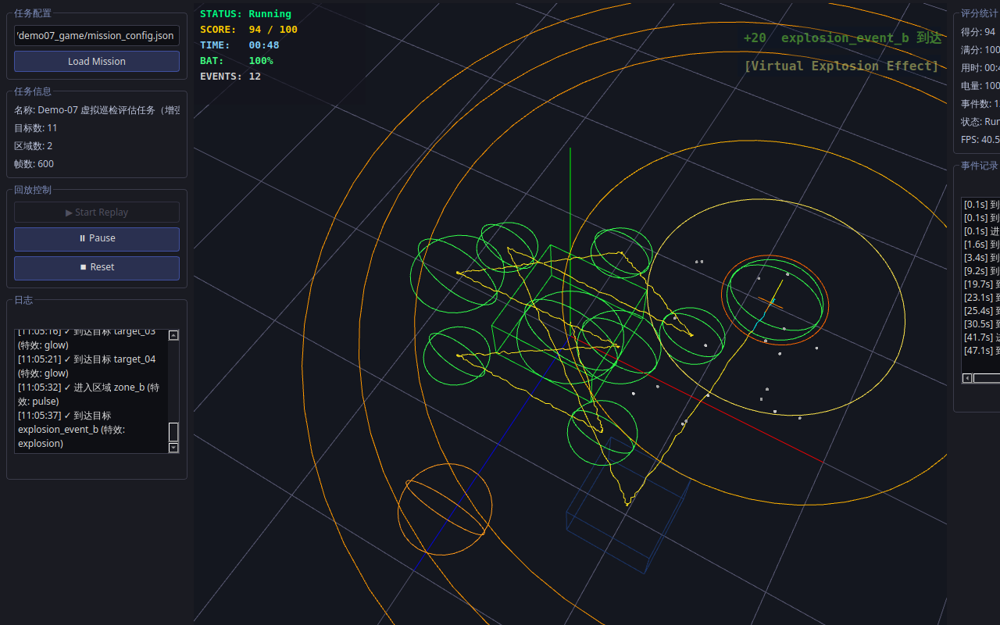 | 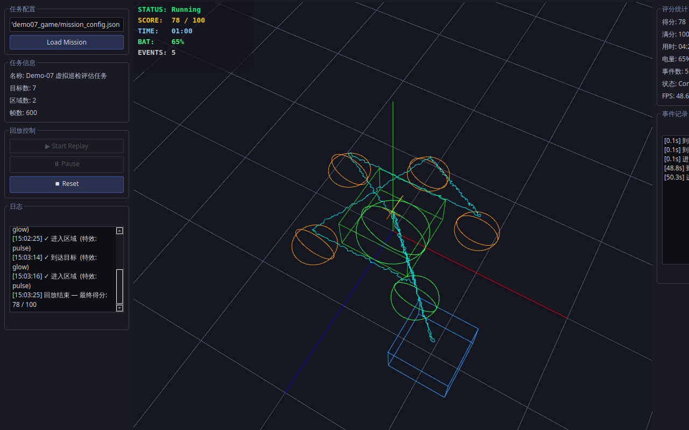 |

### Demo-06：摄影测量模型 + 3DGS 双源场景融合显示
> 独立目录 `apps/demo06_dual_scene_fusion/`，支持四种融合模式与独立坐标对齐

| Dual Fusion 融合渲染模式 | 独立坐标对齐与统计面板 |
|:---:|:---:|
| 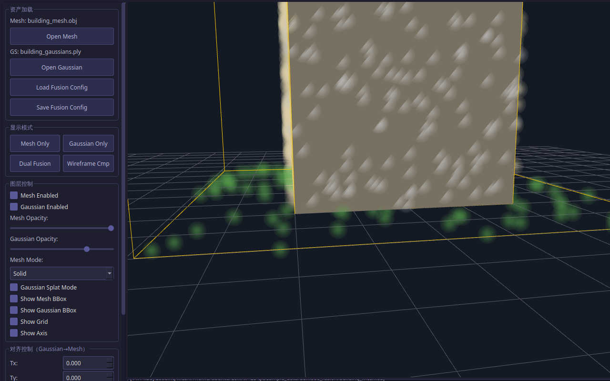 | 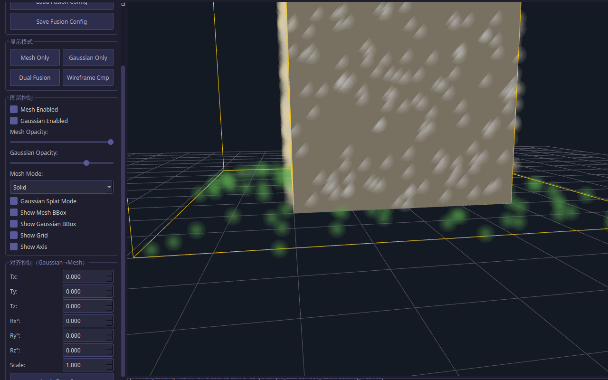 |

### Demo-05：3D Gaussian Splatting 场景加载与显示
> 独立目录 `apps/demo05_gaussian_splat_viewer/`，基于 PLY 解析 + Point/Splat 双模式渲染

| 低空场景 Splat 渲染 | 旋转视角完整统计面板 |
|:---:|:---:|
|  |  |

### Demo-04：MAVLink 无人机遥测接入与三维显示
> 独立目录 `apps/demo04_mavlink_telemetry_viewer/`，基于 MAVLink Raw 协议解析 + 坐标转换复用

| 遥测状态面板（实时显示状态） | OrbitCamera 侧视立体轨迹 |
|:---:|:---:|
| 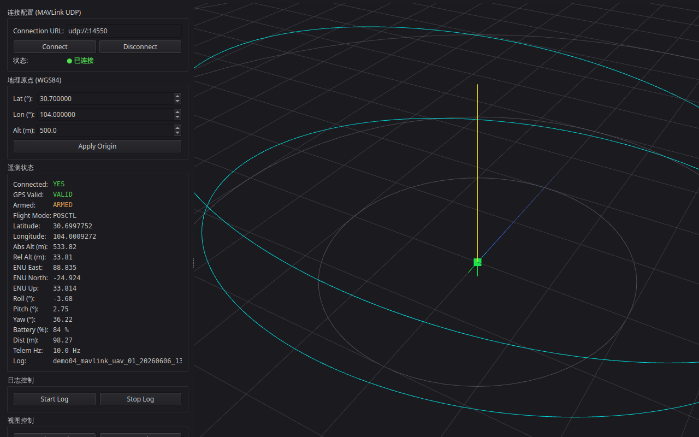 | 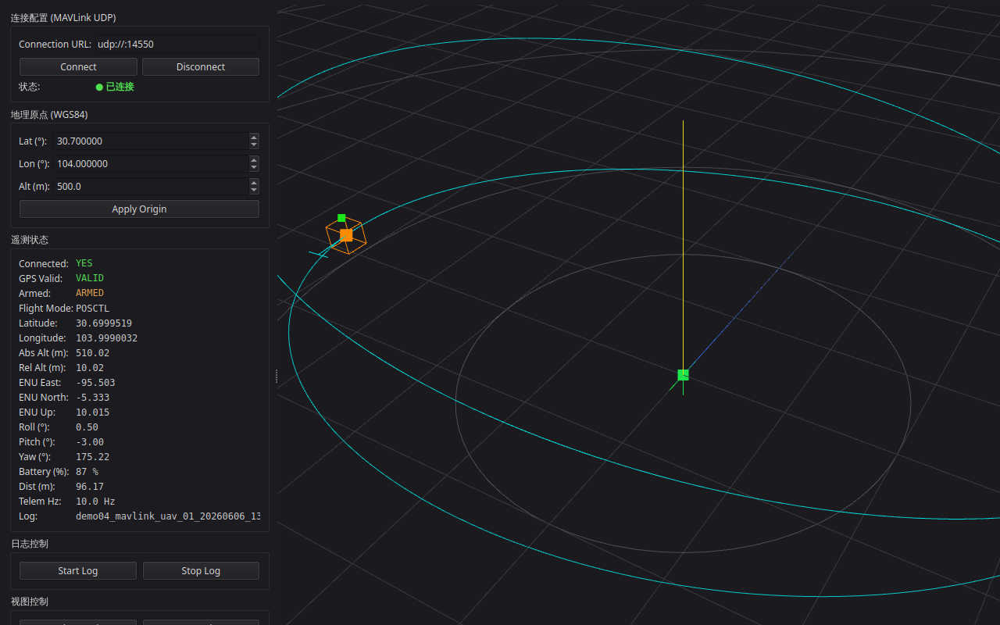 |

### Demo-03：WGS84 / ENU / SCENE 坐标转换与真实位置对齐
> 独立目录 `apps/demo03_geo_coordinate_alignment/`，基于内置 WGS84 椭球公式 + Qt6 + OpenGL

| 坐标转换面板（四级坐标实时显示） | ENU 椭圆轨迹显示 |
|:---:|:---:|
| 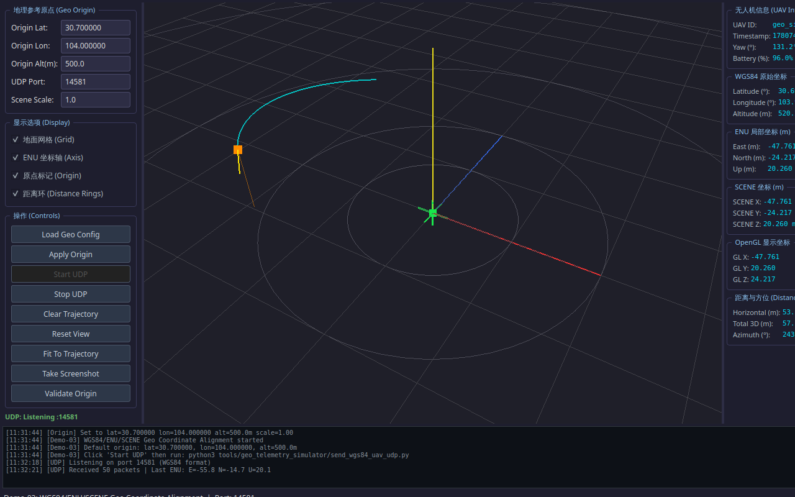 | 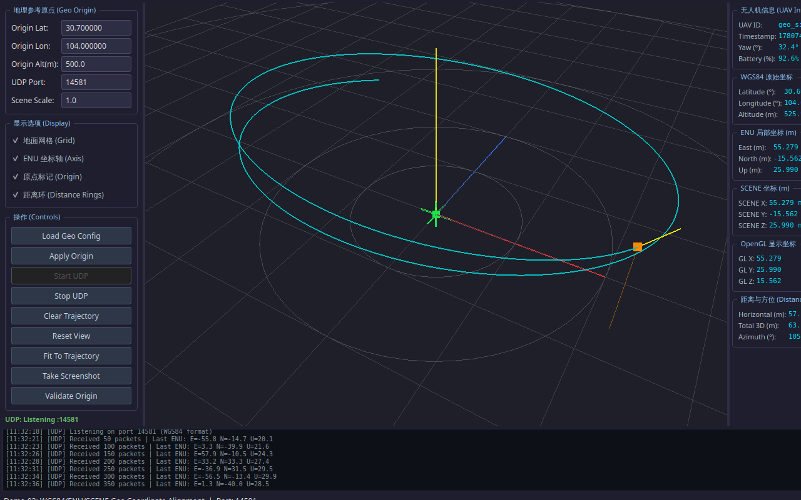 |

### Demo-02：静态三维资产加载与渲染
> 独立目录 `apps/demo02_static_asset_viewer/`，基于 Assimp 和现代 OpenGL（VAO/VBO/Shader）

| 模型实体渲染（Blinn-Phong 光照） | 交互式相机视角（OrbitCamera） |
|:---:|:---:|
| 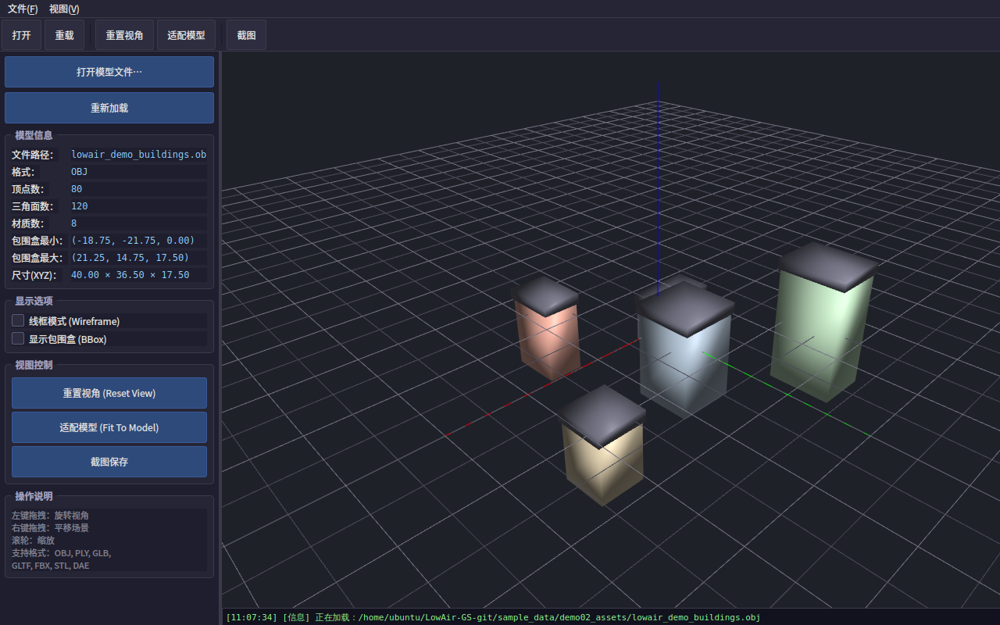 | 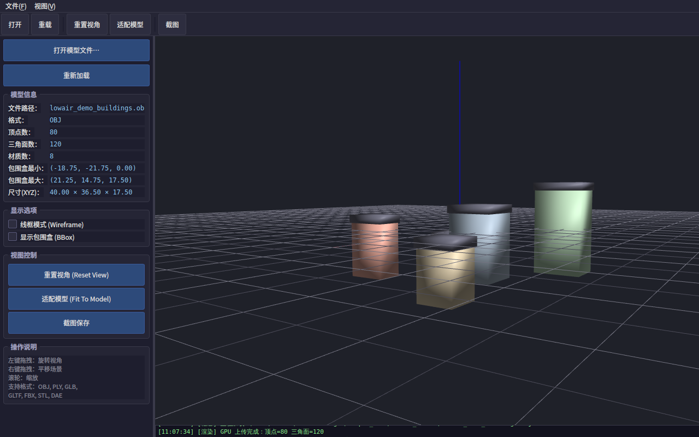 |

### Demo-01：UDP 无人机遥测接入与简化低空场景显示
> 独立目录 `apps/uav_scene_fusion_qt/`，基于 Qt6 + OpenGL + UDP JSON

| 初始场景（内置简化几何体） | 无人机实时飞行（完整轨迹） |
|:---:|:---:|
| 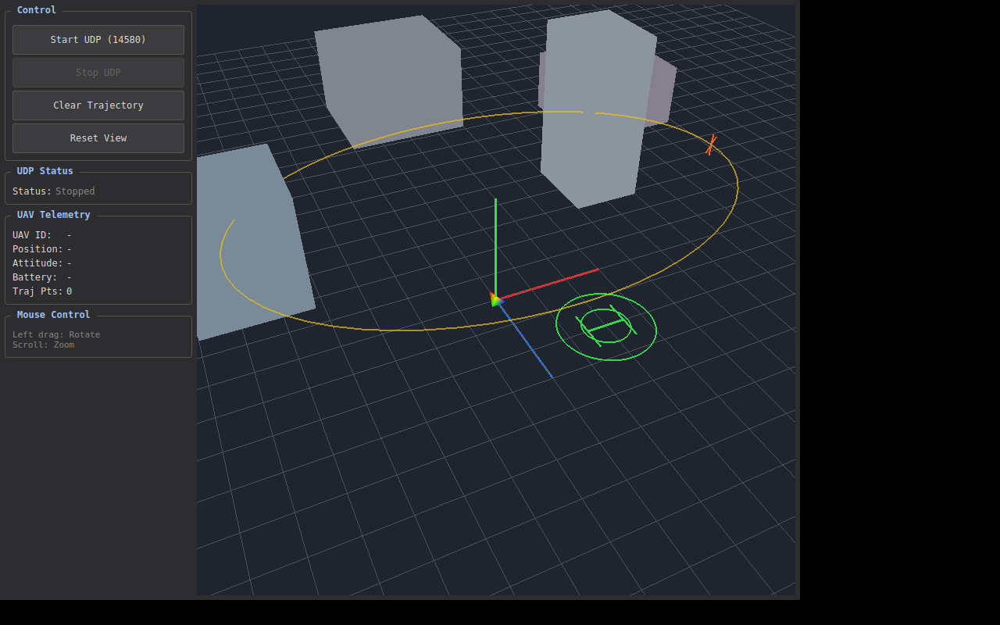 | 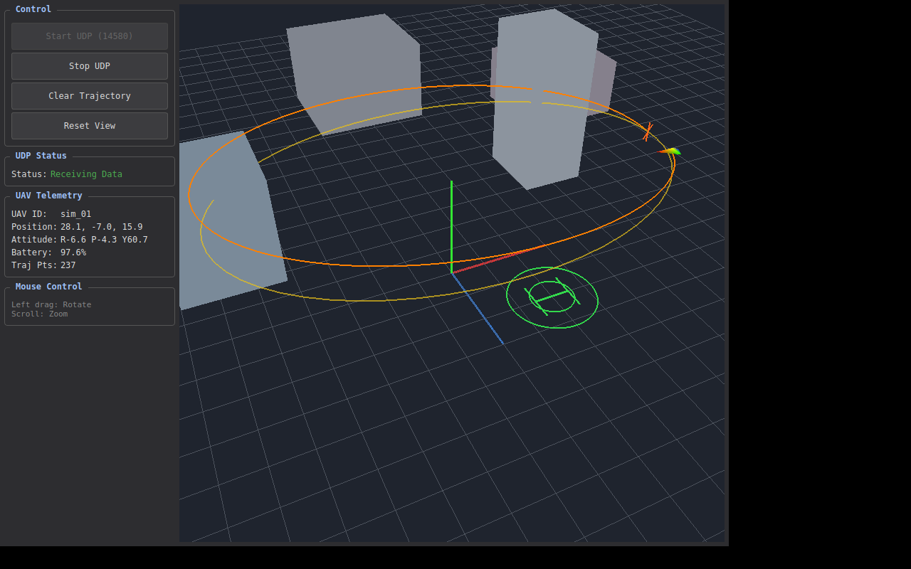 |

**图示说明：**
- **深色主题界面**：符合工业级 GCS UI 设计标准，高信息密度状态面板
- **内置简化场景**：地面网格、XYZ 坐标轴、建筑块、绿色起降圆环、黄色参考航线
- **无人机与轨迹**：四面体无人机模型（带姿态旋转）与橙色历史飞行轨迹（最多 1000 点）
- **零外部依赖**：场景完全由程序内部 `QOpenGLShaderProgram` 绘制，**未引入** Assimp 等外部模型库，确保核心框架清晰轻量

快速运行：
```bash
git clone https://github.com/SWJTU-AI-Lab/LowAir-GS.git && cd LowAir-GS
chmod +x install.sh && ./install.sh
./apps/uav_scene_fusion_qt/build/UavSceneFusionQt &
python3 tools/telemetry_simulator/send_uav_udp.py
```

---

## 1. 项目背景

低空智能系统正在从“单一飞行控制”走向“环境感知、语义理解、任务规划与协同决策”的综合系统形态。无人机在巡检、应急救援、校园测绘、交通感知、低空物流和城市治理等场景中，越来越需要具备对周围环境的三维建模能力。

传统摄影测量方法可以生成点云、网格、正射影像和数字高程模型，适合测绘与几何分析；3D Gaussian Splatting 则可以利用多视角图像生成高真实感、可实时浏览的新视角渲染结果，适合展示、交互和低空场景可视化。本项目希望将二者结合，形成一套面向低空复杂环境的三维重建实践框架。

---

## 2. 项目目标

本项目的主要目标包括：

- 构建基于无人机低空影像和 3D Gaussian Splatting 的三维重建流程；
- 跑通“图像采集—位姿估计—3DGS 训练—模型导出—网页展示”的完整链路；
- 分析不同低空采集策略对重建质量的影响，如俯视、斜视、环绕、多高度航线等；
- 对图像数量、图像分辨率、运动模糊、动态目标、树木遮挡等因素进行实验评估；
- 建设可用于课程展示、项目答辩和科研汇报的三维可视化 Demo；
- 探索道路、建筑、树木、车辆、可降落区域等低空语义对象的三维表达方法。

---

## 3. 技术路线

项目整体流程如下：

```text
无人机影像 / 手持相机影像 / 视频抽帧图像
        ↓
图像筛选、模糊剔除、去冗余、畸变校正、语义掩码预处理
        ↓
COLMAP / OpenDroneMap 相机位姿估计
        ↓
稀疏点云、相机内参、相机外参
        ↓
3D Gaussian Splatting 模型训练
        ↓
PLY / SPLAT 模型导出
        ↓
网页可视化、漫游视频、交互式场景浏览
        ↓
语义标注、目标查询、低空场景理解与应用展示
```

可以把它理解为一条完整的低空三维重建流水线：

```text
看得见：低空影像采集
算得准：相机位姿估计
建得出：三维高斯重建
跑得动：轻量可视化展示
用得上：语义增强与低空应用
```

---

## 4. 推荐开源工具

| 类别 | 推荐工具 | 主要用途 |
|---|---|---|
| 位姿估计与摄影测量 | COLMAP、OpenDroneMap、WebODM | 相机位姿估计、稀疏点云、稠密点云、无人机摄影测量基线 |
| 3DGS 训练 | graphdeco-inria/gaussian-splatting、Nerfstudio Splatfacto、gsplat | 三维高斯模型训练、新视角渲染、算法复现与扩展 |
| 可视化展示 | Nerfstudio Viewer、SuperSplat、GaussianSplats3D | 交互式浏览、网页展示、模型检查与发布 |
| 语义增强 | SAM、LangSplat、Gaussian Grouping、SAGA | 语义掩码、开放词汇查询、三维高斯分割 |
| 大场景扩展 | CityGaussian、VastGaussian | 大范围场景分块训练、多块融合、低空大场景展示 |

项目初期建议优先使用：

```text
COLMAP + Nerfstudio Splatfacto + SuperSplat
```

这一组合对学生比较友好，能够较快跑通从数据处理到模型展示的基础链路。

---

## 5. 推荐数据来源

项目可以分为“公开数据集复现”和“自采低空数据”两类数据来源。

### 5.1 公开数据集

| 数据集 | 适合用途 |
|---|---|
| WebODM 示例数据 | 快速熟悉无人机影像处理流程 |
| Mip-NeRF 360 | 学习新视角合成和 3DGS 评价指标 |
| Tanks and Temples | 真实场景三维重建基准测试 |
| Mill-19 / Mega-NeRF | 大规模无人机或工业场景重建实验 |
| UrbanScene3D | 城市场景、低空航拍、多尺度三维重建 |
| EuRoC MAV | 视觉惯性定位、位姿估计和 SLAM 对比 |
| TartanAir | 仿真环境下的深度、语义、位姿真值验证 |
| UAVid | 城市低空视频语义分割与动态目标处理 |

### 5.2 自采低空数据

建议第一阶段选择小范围场景，例如：

- 一栋教学楼或实验楼；
- 一个小广场；
- 一段道路或人行通道；
- 建筑入口、停车区、树木和开阔地组合场景。

首轮数据规模建议控制在 200 到 600 张图像，不要一开始采集过大范围场景。采集时应尽量保证图像清晰、重叠充分、曝光稳定，并覆盖俯视、斜视和环绕视角。

---

## 6. 仓库结构

当前实际的仓库结构如下：

```text
LowAir-GS/
├── README.md
├── apps/
│   ├── uav_scene_fusion_qt/            # Demo-01 Qt C++ 主程序
│   ├── demo02_static_asset_viewer/     # Demo-02 静态三维资产查看器
│   ├── demo03_geo_coordinate_alignment/# Demo-03 WGS84 坐标转换演示器
│   ├── demo04_mavlink_telemetry_viewer/# Demo-04 MAVLink 遥测演示器
│   ├── demo05_gaussian_splat_viewer/   # Demo-05 3DGS 场景加载演示器
│   └── demo06_dual_scene_fusion/       # Demo-06 双源融合查看器
├── tools/
│   ├── telemetry_simulator/            # Python 无人机遥测模拟器
│   ├── geo_telemetry_simulator/        # Python WGS84 遥测模拟器
│   ├── mavlink_simulator/              # Python MAVLink 模拟器
│   ├── model_generators/               # Python 三维资产生成脚本
│   └── gaussian_generators/            # Python 高斯资产生成脚本
├── sample_data/
│   ├── demo02_assets/                  # Demo-02 示例三维资产
│   ├── demo03_geo/                     # Demo-03 示例地理数据
│   ├── demo05_gaussians/               # Demo-05 示例高斯数据
│   └── demo06_fusion/                  # Demo-06 示例双源融合数据
├── screenshots/
│   ├── demo02/                         # Demo-02 验收截图
│   ├── demo03/                         # Demo-03 验收截图
│   ├── demo04/                         # Demo-04 验收截图
│   ├── demo05/                         # Demo-05 验收截图
│   └── demo06/                         # Demo-06 验收截图
├── docs/
│   ├── DEMO_ROADMAP.md                 # 项目 Demo 路线图
│   └── tasks/                          # 学生任务分工与验收要求
└── .gitignore
```

说明：

- `apps/` 存放各独立 Demo 的 Qt C++ 源码项目；
- `tools/` 存放配套的 Python 工具脚本（模拟器、资产生成等）；
- `sample_data/` 存放各 Demo 需要的示例数据文件；
- `screenshots/` 存放各 Demo 的运行验收截图；
- `docs/` 用于存放项目路线图规划、实验设计和学生任务卡。

---

## 7. 最小可行版本

第一版不建议直接做大规模城市场景，而应聚焦一个小而完整的低空场景：

> 一栋楼体 + 一个小广场 + 一段道路

最低成果要求如下：

| 成果类型 | 基本要求 |
|---|---|
| 低空图像数据 | 采集 200 到 600 张图像，包含俯视、斜视、环绕等多类视角 |
| 位姿估计结果 | 使用 COLMAP 或 OpenDroneMap 完成相机位姿估计，尽量保证大部分图像成功注册 |
| 三维高斯模型 | 训练得到可浏览的 3DGS 场景模型 |
| 对比实验 | 至少完成 3 组实验，如图像数量、分辨率、模糊剔除、航线方式对比 |
| 可视化成果 | 形成一个可交互展示页面或 Viewer 录屏，并生成 1 分钟左右的漫游视频 |
| 实验报告 | 说明数据采集、处理流程、实验结果、问题分析和后续改进方向 |

---

## 8. 学生实践流程

建议学生按照以下步骤开展：

1. 使用公开样例数据跑通 3DGS 基础流程；
2. 学习 COLMAP 或 OpenDroneMap 的相机位姿估计过程；
3. 采集一个小范围校园低空场景数据集；
4. 对图像进行筛选、去模糊、抽帧和格式整理；
5. 训练基础 3D Gaussian Splatting 模型；
6. 导出模型并进行交互式浏览；
7. 设计对比实验，分析影响重建质量的关键因素；
8. 补充语义标注、目标说明或简单对象查询功能；
9. 形成实验报告、结果图表、演示视频和答辩材料。

---

## 9. 可扩展研究方向

后续可以围绕以下方向继续深入：

- 低空航线规划与 3DGS 重建质量关系分析；
- 面向无人机影像的模糊图像剔除与视频抽帧优化；
- 行人、车辆、树叶晃动等动态干扰的语义掩码处理；
- 传统摄影测量与 3D Gaussian Splatting 的混合重建流程；
- 大范围校园场景的分块训练与多块融合展示；
- 面向低空巡检的建筑、道路、树木、车辆等语义高斯场景构建；
- 低空三维场景的网页轻量化展示、模型压缩与移动端浏览；
- 面向应急救援、校园管理、低空交通的三维场景应用 Demo。

---

## 10. 项目分工建议

如果作为 SRTP 或课程项目，可以按照以下方式分工：

| 小组 | 主要任务 | 预期成果 |
|---|---|---|
| 数据采集组 | 设计采集路线、完成无人机或手持图像采集、整理数据集 | 低空图像数据集、采集记录、场景说明 |
| 位姿重建组 | 使用 COLMAP / OpenDroneMap 完成相机位姿估计和点云生成 | 相机参数、稀疏点云、重建日志 |
| 3DGS 算法组 | 完成 3DGS 训练、参数调试和模型导出 | 高斯模型、训练曲线、渲染结果 |
| 可视化展示组 | 使用 Viewer、SuperSplat 或网页工具展示结果 | 交互式 Demo、漫游视频、展示截图 |
| 语义增强组 | 尝试语义分割、目标标注和动态目标处理 | 语义标注结果、对象查询 Demo、对比分析 |

人数较少时，也可以合并为三组：

```text
数据与位姿组 + 三维重建组 + 展示与报告组
```

---

## 11. 阶段计划

| 阶段 | 主要任务 | 验收结果 |
|---|---|---|
| 第 1 阶段 | 跑通公开样例数据 | 能够成功训练并浏览一个 3DGS 示例场景 |
| 第 2 阶段 | 完成校园小场景采集 | 形成原始图像数据、采集说明和数据目录 |
| 第 3 阶段 | 完成位姿估计 | 得到 COLMAP / ODM 输出结果和重建日志 |
| 第 4 阶段 | 完成基础 3DGS 训练 | 得到可浏览模型、训练记录和渲染结果 |
| 第 5 阶段 | 完成对比实验 | 形成实验表格、质量评价和问题分析 |
| 第 6 阶段 | 完成展示系统和报告 | 形成 Demo、视频、PPT 和结题报告 |

---

## 12. 当前状态

**Demo-01 基础框架重构版已提交（2026-06-06）。** 
详见：[Demo 路线图 (DEMO_ROADMAP.md)](docs/DEMO_ROADMAP.md)

### 12.1 Demo 完成情况

#### Demo-06: 摄影测量模型 + 3DGS 双源场景融合显示 (已完成)
- [x] **独立 Qt C++ 双源融合查看器**（`apps/demo06_dual_scene_fusion/`）
  - **资产加载**：支持 OBJ/PLY 网格模型和 PLY/.splat 高斯模型同屏加载
  - **四种模式**：支持 Mesh Only、Gaussian Only、Dual Fusion、Wireframe Comparison
  - **对齐控制**：支持对双源资产进行独立的平移、旋转、缩放对齐控制
  - **性能统计**：实时统计顶点数、面片数、高斯数量、FPS 和 VRAM
- [x] **Python 资产生成脚本**（`tools/gaussian_generators/generate_demo06_assets.py`）
  - 自动生成测试用的简易 Mesh 和 Gaussian 资产，以及融合配置 JSON

#### Demo-07: 虚拟目标、事件、特效与游戏化评估 (已完成)
- [x] **独立 Qt C++ 游戏化评估系统**（`apps/demo07_game_event_evaluation/`）
  - **虚拟目标与区域**：支持 JSON 配置的 3D 虚拟目标点和触发区域
  - **事件引擎**：实时监控无人机轨迹，自动触发到达、进入、离开等事件
  - **特效与增强渲染**：集成目标发光（Glow）、粒子爆发（Particle）、Label Popup弹窗、Path Highlight轨迹高亮、Zone Outline区域脉冲动画以及虚拟爆炸视觉特效（Virtual Explosion）
  - **游戏化评分**：基于事件、时间、电量进行自动化评分并生成任务报告
- [x] **Python 示例数据生成脚本**（`tools/gaussian_generators/generate_demo07_assets.py`）
  - 自动生成任务配置、虚拟目标、触发区域、评分规则和轨迹回放数据

#### Demo-05: 3D Gaussian Splatting 场景加载与显示 (已完成)
- [x] **独立 Qt C++ 3DGS 查看器**（`apps/demo05_gaussian_splat_viewer/`）
  - **资产加载**：支持标准 3DGS PLY 格式解析（位置、颜色、缩放、旋转、不透明度）
  - **双模式渲染**：支持 Point 模式（快速预览）和 Splat 模式（Billboard 渲染）
  - **性能统计**：实时 FPS、帧耗时、VRAM 显存占用估算
- [x] **Python 资产生成脚本**（`tools/gaussian_generators/generate_demo05_gaussians.py`）
  - 生成球形分布点云及带语义层的低空无人机场景点云

#### Demo-04: MAVLink 无人机遥测接入与三维显示 (已完成)
- [x] **独立 Qt C++ 遥测演示器**（`apps/demo04_mavlink_telemetry_viewer/`）
  - **协议接入**：监听 UDP 解析 MAVLink v1 原始数据流（`HEARTBEAT`, `GLOBAL_POSITION_INT` 等）
  - **坐标复用**：复用 Demo-03 的 `CoordinateTransformer` 进行 WGS84→ENU 转换
  - **UI 面板**：实时显示遥测状态（飞行模式、电量、经纬高、姿态角），支持飞行日志记录
- [x] **Python MAVLink 模拟器**（`tools/mavlink_simulator/send_mavlink_uav_udp.py`）
  - 模拟发送标准 MAVLink 协议数据包

#### Demo-03: WGS84 / ENU / SCENE 坐标转换与真实位置对齐 (已完成)
- [x] **独立 Qt C++ 坐标转换演示器**（`apps/demo03_geo_coordinate_alignment/`）
  - **坐标转换**：实现 WGS84 → ECEF → ENU → SCENE 的完整链路
  - **OpenGL 渲染**：实时渲染地理原点、ENU坐标轴、无人机实体及历史轨迹
  - **UI 面板**：支持动态配置原点经纬高、一键校验坐标转换精度
- [x] **Python WGS84 模拟器**（`tools/geo_telemetry_simulator/send_wgs84_uav_udp.py`）
  - 模拟无人机绕地理原点做椭圆轨迹飞行，发送真实经纬高数据

#### Demo-02: 静态三维资产加载与渲染 (已完成)
- [x] **独立 Qt C++ 资产查看器**（`apps/demo02_static_asset_viewer/`）
  - **Assimp 模型加载**：支持 OBJ/PLY/GLB 等标准三维格式
  - **现代 OpenGL 渲染管线**：VAO/VBO/Shader 架构，支持 Blinn-Phong 光照
  - **交互式相机控制**：OrbitCamera，支持旋转、缩放、平移、适配模型
  - **模型信息面板**：实时显示顶点数、面数、材质数、包围盒尺寸
  - **多模式渲染**：支持实体、线框（Wireframe）、包围盒（BBox）切换
- [x] **Python 资产生成脚本**（`tools/model_generators/generate_demo02_assets.py`）
  - 自动生成带材质的建筑块模型和地形网格模型

#### Demo-01: UDP 无人机遥测接入与简化低空场景显示 (已完成)
- [x] **Qt C++ 主程序**（`apps/uav_scene_fusion_qt/`）
  - 零外部三维库依赖，内置简化场景，UDP JSON 遥测接收，无人机轨迹渲染
- [x] **Python 无人机模拟器**（`tools/telemetry_simulator/send_uav_udp.py`）
- [x] **完整文档体系**（`USER_MANUAL.md`, `DEV_GUIDE.md`, `TECHNICAL_REPORT.md`）

### 12.2 快速开始

```bash
# 1. 克隆仓库
git clone https://github.com/SWJTU-AI-Lab/LowAir-GS.git
cd LowAir-GS

# 2. 一键安装依赖并编译
chmod +x install.sh && ./install.sh

# 3. 启动程序，点击 Start UDP
./apps/uav_scene_fusion_qt/build/UavSceneFusionQt

# 4. 新开终端，启动模拟器
python3 tools/telemetry_simulator/send_uav_udp.py
```

### 12.3 后续计划

后续将逐步补充：

- 数据采集规范与低空航线设计指南；
- COLMAP / OpenDroneMap 处理流程脚本；
- Nerfstudio Splatfacto 训练脚本；
- SuperSplat 展示流程；
- 实验指标与结果模板；
- SRTP 结题报告与答辩材料模板。

---

## 13. 引用说明

如果本项目对课程实践、SRTP 项目或科研原型有帮助，可以在报告或论文中引用本仓库：

```bibtex
@misc{lowairgs2026,
  title        = {LowAir-GS: Low-Altitude 3D Gaussian Splatting Reconstruction System},
  author       = {SWJTU-AI-Lab},
  year         = {2026},
  howpublished = {\url{https://github.com/SWJTU-AI-Lab/LowAir-GS}}
}
```

---

## 14. 开源协议

开源协议待项目维护者确认后补充。若主要用于课程教学、SRTP 实践和科研原型，建议后续根据代码来源和二次开发方式选择 MIT、Apache-2.0 或其他合适协议。
