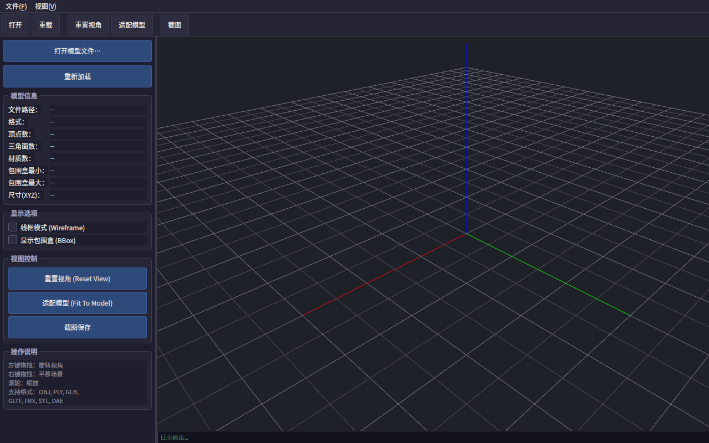
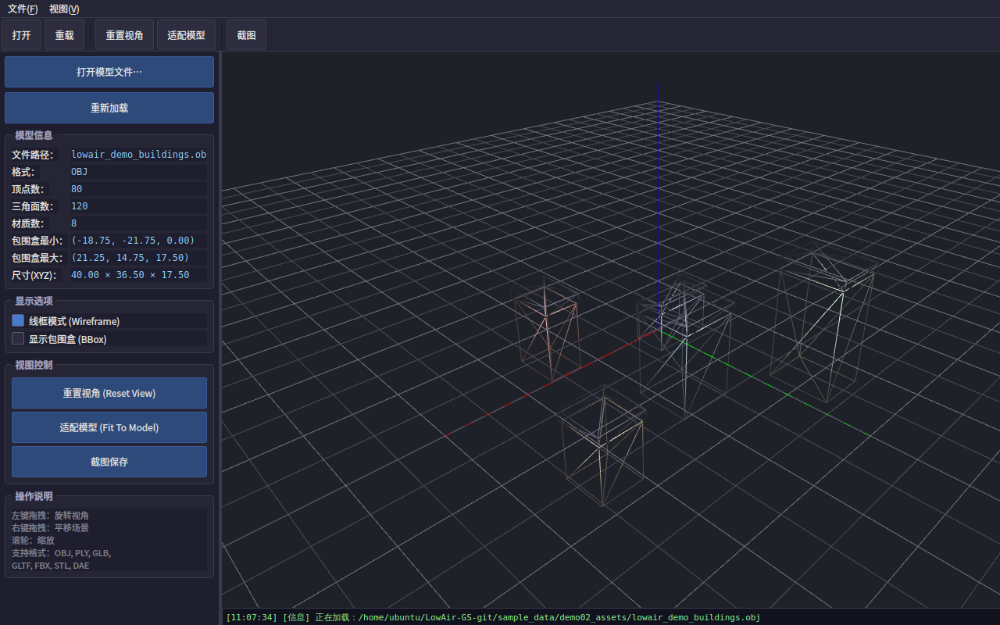
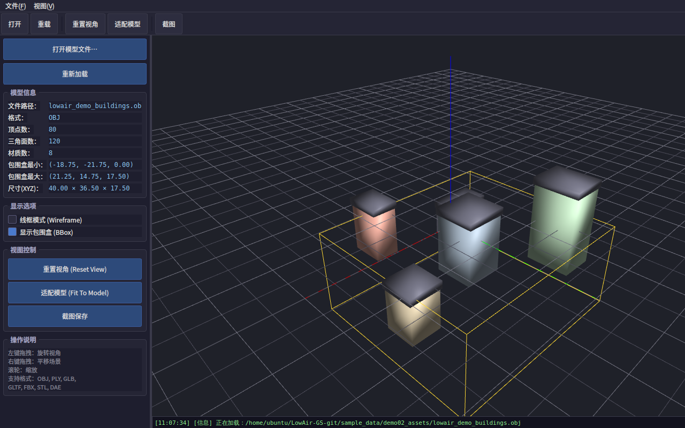
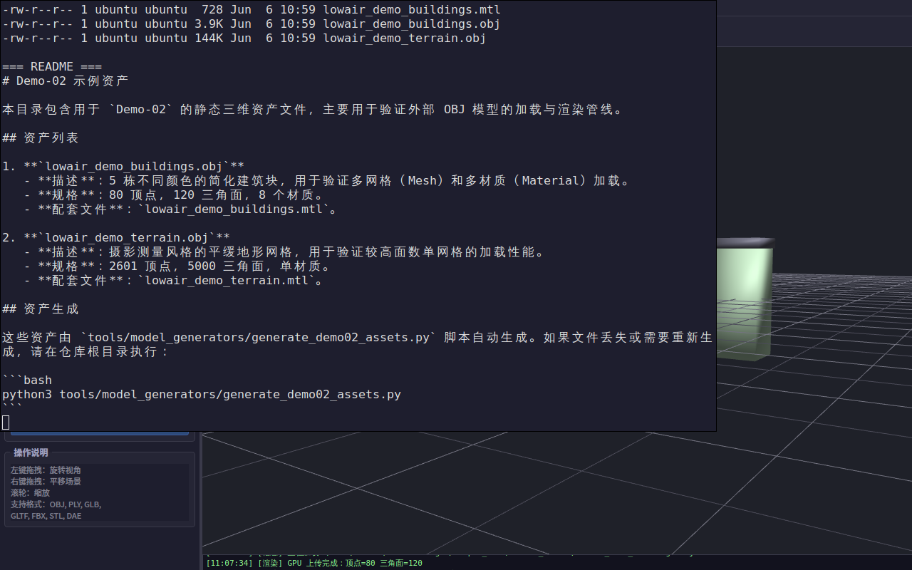

# Demo-02: 静态三维资产加载与渲染

本演示单元展示了如何在 Qt 框架中使用 Assimp 库加载和渲染外部静态三维资产（如 OBJ、PLY、GLB 格式的摄影测量模型）。它实现了一个完整的现代 OpenGL（VAO/VBO/Shader）渲染管线，支持模型信息查看、线框模式、包围盒显示以及交互式相机控制。

## 核心功能

- **外部资产加载**：基于 Assimp，支持 OBJ、PLY、GLB 等多种标准三维格式。
- **现代 OpenGL 渲染**：使用 Qt 的 `QOpenGLShaderProgram` 和 `QOpenGLBuffer`，实现高效的网格渲染（Blinn-Phong 光照）。
- **交互式相机控制**：实现 `OrbitCamera`，支持鼠标左键旋转、右键平移、滚轮缩放，以及“适配模型”功能。
- **模型信息面板**：实时解析并显示顶点数、三角面数、材质数和包围盒尺寸。
- **多种显示模式**：支持实体渲染、线框模式（Wireframe）和包围盒（BBox）渲染切换。

## 功能边界说明

根据项目规划，本 Demo 作为独立演示单元，其功能边界明确如下：
- **仅包含静态模型加载与渲染**：本单元专注于三维模型文件的解析与显示。
- **不包含 UDP 遥测**：与 Demo-01 隔离，不接收无人机遥测数据。
- **不包含坐标转换**：所有模型在局部坐标系中渲染，暂不涉及 WGS84 地理坐标转换（将在 Demo-03 中实现）。
- **不包含动态元素**：不渲染动态无人机模型或轨迹（将在 Demo-04 中实现）。

## 依赖要求

- Qt 6.x（Core, Gui, Widgets, OpenGLWidgets）
- Assimp 5.x 库（`libassimp-dev` 或源码编译）

## 编译与运行

```bash
# 在本 Demo 目录下
mkdir build && cd build
cmake ..
make -j4

# 运行程序（不带参数）
./Demo02StaticAssetViewer

# 运行程序并加载指定模型
./Demo02StaticAssetViewer --model ../../../sample_data/demo02_assets/lowair_demo_buildings.obj
```

## 运行截图与验收标准

本 Demo 达到以下验收标准，各功能点运行截图如下：

1. **程序启动初始状态**：启动后正确显示三维网格（Grid）和坐标轴（Axis），状态栏显示“就绪”。
   

2. **模型实体渲染**：成功加载 `lowair_demo_buildings.obj`，多网格、多材质颜色正确显示（Blinn-Phong 光照生效）。
   

3. **线框模式**：勾选“线框模式”后，正确渲染模型的网格线框。
   

4. **包围盒与信息面板**：勾选“显示包围盒”后，正确渲染 AABB 包围盒；左侧面板准确解析并显示顶点数（80）、三角面数（120）和材质数（8）。
   

5. **相机交互视角**：通过鼠标拖拽（OrbitCamera）可自由旋转、缩放、平移视角。
   

6. **示例资产验证**：配套的示例资产文件夹 `sample_data/demo02_assets/` 结构完整，包含自动生成脚本说明。
   

## 常见问题 (FAQ)

**Q1: 编译时提示找不到 Assimp 库 (`Could NOT find assimp`) 怎么办？**
A1: 确保已安装 Assimp 库。如果是 Ubuntu 系统，可以运行 `sudo apt-get install libassimp-dev`。如果是从源码编译，请确保 `libassimp.so` 在系统路径（如 `/usr/local/lib`）中，并可能需要运行 `sudo ldconfig` 更新动态链接库缓存。

**Q2: 加载模型后界面全黑，看不到模型？**
A2: 可能是模型尺寸过大或偏离原点太远。请点击左侧控制面板中的“适配模型 (Fit To Model)”按钮，相机会自动调整距离和目标点以完整显示整个模型。

**Q3: 示例资产文件丢失了怎么办？**
A3: 示例资产由 Python 脚本自动生成。如果在 `sample_data/demo02_assets/` 目录下找不到 `.obj` 文件，请在项目根目录运行 `python3 tools/model_generators/generate_demo02_assets.py` 重新生成。

## 目录结构

- `asset/`：模型资产解析模块（Assimp 封装）。
- `camera/`：相机控制模块（OrbitCamera）。
- `render/`：OpenGL 渲染器（Mesh、Grid、Axis、BoundingBox）。
- `MainWindow` / `RenderWidget`：UI 与 OpenGL 视图核心逻辑。
