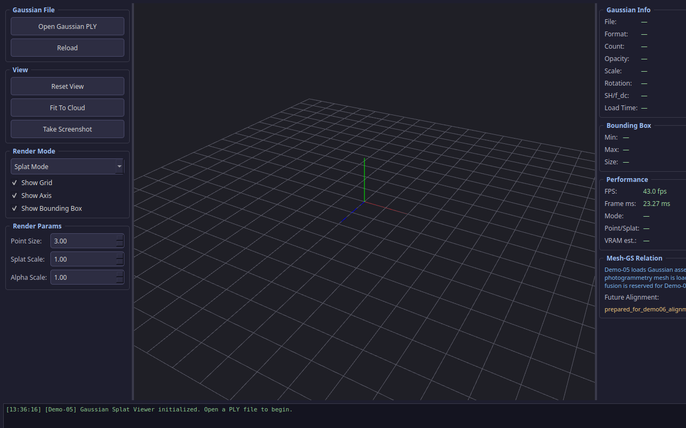
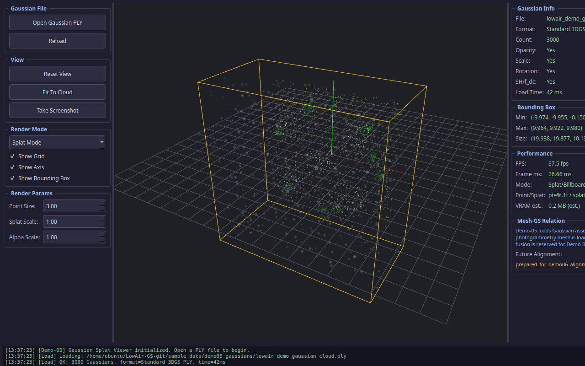
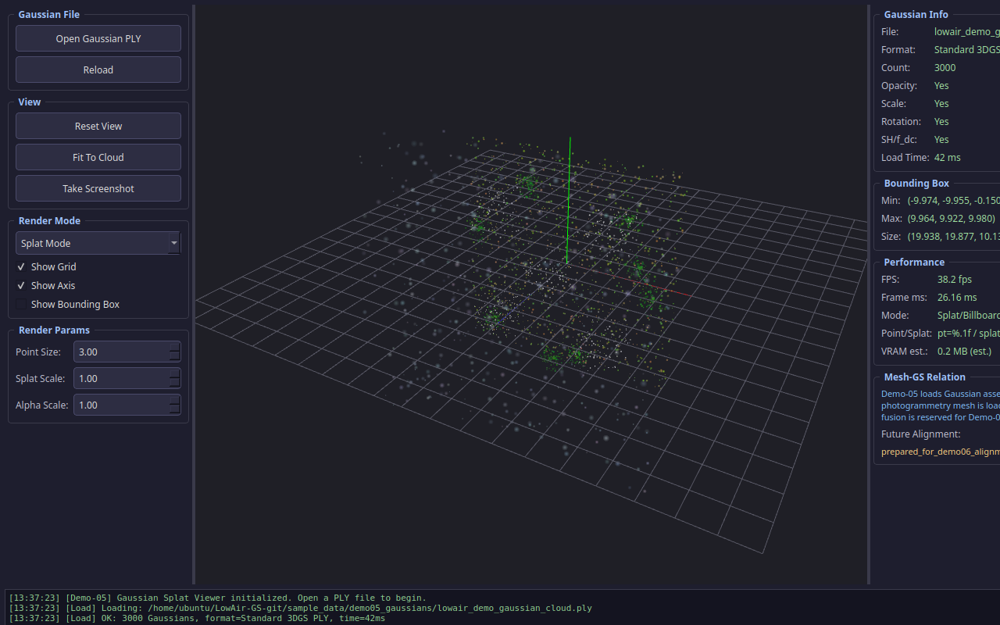

# Demo-05: Gaussian Splat Viewer

本 Demo 演示了如何使用 C++ 和 Qt OpenGL 独立加载和渲染 3D Gaussian Splatting（3DGS）场景。这是构建“低空数字孪生”环境的重要一步。

## 1. 核心功能

- **PLY 解析器**：支持标准 3DGS PLY 格式，解析位置、颜色（SH/f_dc）、不透明度、缩放和旋转四元数。
- **双模式渲染**：
  - **Point Mode**：将 Gaussian 渲染为带颜色的点，适合快速预览和调试。
  - **Splat Mode**：使用 Billboard 渲染技术，将 Gaussian 渲染为朝向相机的椭圆面片，模拟真实的 3DGS 渲染效果。
- **性能统计**：实时显示帧率（FPS）、帧耗时（ms）和 VRAM 显存占用估算。
- **包围盒计算**：自动计算场景包围盒（Bounding Box），支持“Fit To Cloud”视角重置。

## 2. 编译与运行

### 2.1 依赖项
- Qt 6.x (Core, Gui, Widgets, OpenGLWidgets)
- OpenGL 3.3+

### 2.2 编译步骤
```bash
mkdir build && cd build
cmake .. -DCMAKE_BUILD_TYPE=Release
make -j$(nproc)
```

### 2.3 运行方式
```bash
# 启动程序（可通过 UI 面板打开文件）
./Demo05GaussianSplatViewer

# 启动并直接加载示例数据
./Demo05GaussianSplatViewer --gaussian ../../../sample_data/demo05_gaussians/lowair_demo_gaussian_cloud.ply
```

## 3. 验收截图展示

| 程序启动状态 | 加载小型点云 (Splat) | 加载小型点云 (Point) |
|:---:|:---:|:---:|
|  |  |  |

| 加载低空场景 (Splat) | 加载低空场景 (Point) | 旋转视角完整统计 |
|:---:|:---:|:---:|
|  |  |  |

## 4. 支持字段与格式假设

本程序支持标准 3DGS PLY 格式及紧凑的 `.splat` 二进制格式。

### 4.1 PLY 字段支持
- **位置**：`x`, `y`, `z`
- **颜色**：支持 `f_dc_0`, `f_dc_1`, `f_dc_2`（球谐函数 0 阶系数），并可扩展解析 `red`, `green`, `blue`, `alpha`
- **不透明度**：`opacity`（加载时应用 `sigmoid` 函数映射至 0-1）
- **缩放**：`scale_0`, `scale_1`, `scale_2`（加载时应用 `exp` 函数还原真实尺度）
- **旋转**：`rot_0`, `rot_1`, `rot_2`, `rot_3`（四元数）

### 4.2 .splat 格式假设
`.splat` 文件解析器（`GaussianSplatLoader`）目前采用教学用紧凑格式假设，即每个 Gaussian 固定占用 32 字节，字段按序紧密排列。真实工程中，不同导出工具（如 WebGL 查看器）的 `.splat` 格式可能有细微差异，实际应用时需根据具体导出工具的文档调整字段布局。

## 5. FAQ (常见问题)

**Q: 为什么渲染时有些 Gaussian 看起来像方块或边缘很硬？**
A: 这是因为当前使用的是基础的 Billboard 渲染。为了保持代码轻量和跨平台，片元着色器中使用了简单的基于中心距离的 Alpha 衰减，未引入基于 CUDA 的精确 2D 协方差光栅化计算。

**Q: 为什么加载包含数百万个 Gaussian 的真实场景时帧率较低？**
A: 本 Demo 旨在演示原理，采用了基于 CPU 的按距离排序算法以处理透明度混合。对于超大规模场景，建议引入基于 GPU 的基数排序（Radix Sort）或直接使用官方 CUDA 光栅化器。

**Q: 这个 Demo 加载了摄影测量网格（Mesh）吗？**
A: 没有。Demo-05 专注于 3DGS 资产的独立加载与渲染。摄影测量网格与 3DGS 资产的双源融合将在后续的 Demo-06 中实现。

## 6. 验收标准

- **编译成功**：在 Ubuntu 24.04 上通过 CMake + Qt6 成功编译，无致命警告。
- **格式支持**：能正确加载 ASCII/Binary PLY 格式及 .splat 格式的 3DGS 资产。
- **渲染模式**：支持在 Point 模式（快速点云）和 Splat 模式（椭圆面片）之间无缝切换。
- **性能统计**：UI 面板能实时显示 FPS 和估算的显存占用。
- **示例数据**：配套 Python 脚本能成功生成用于演示的 `.ply` 数据文件。

## 7. 技术边界与 Demo-06 关系

| 功能项 | Demo-05 (当前) | Demo-06 (后续) |
|---|---|---|
| **加载资产** | 仅加载 3D Gaussian 场景 | 同时加载摄影测量 Mesh 和 3D Gaussian |
| **渲染模式** | 独立 3DGS 渲染 (Point/Splat) | 双源融合渲染 (Mesh + GS 深度混合) |
| **坐标系对齐** | 局部坐标系展示 | Mesh 与 GS 坐标对齐至同一地理坐标系 |
| **应用场景** | 3DGS 资产验证与原理教学 | 真实低空数字孪生场景融合展示 |
